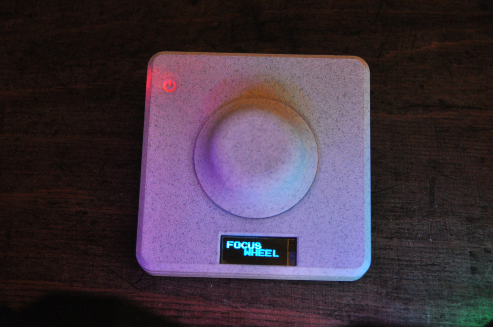
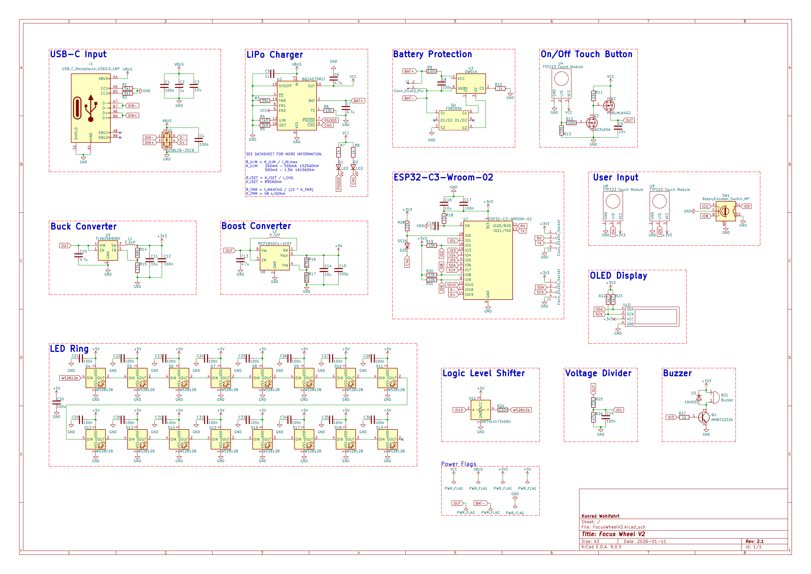
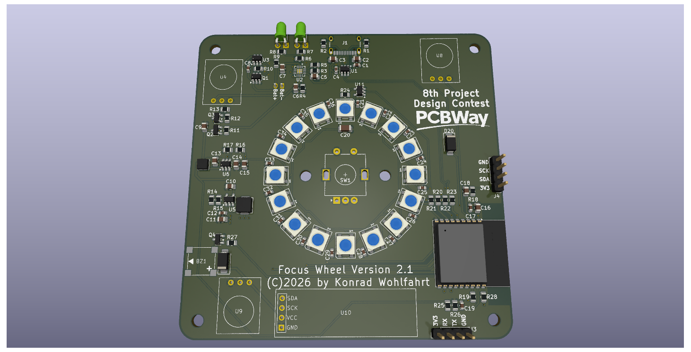
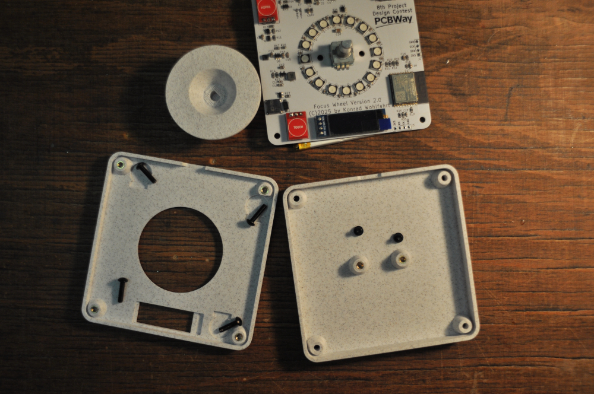
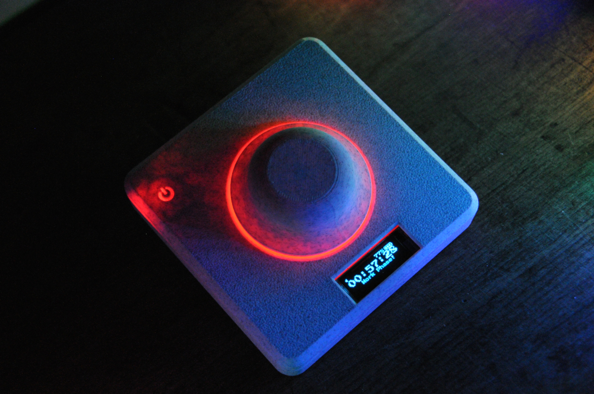

# Focus Wheel 2.0  
**Overview**  
Focus Wheel 2.0 is a compact, standalone focus and time-management device designed to help you stay productive during study sessions or focused work. It combines a clean, minimal design with touch controls, visual feedback, and flexible timer logic, all powered by a rechargeable battery. This second iteration is a major step up from the original Focus Wheel. It introduces battery operation with power-path management, touch-based controls, an integrated LED ring, and a more refined enclosure. The result is a polished desk companion that’s easy to use, highly customizable, and fun to build:  

[Instructables Guide](https://www.instructables.com/)  

**Key Features**  
- *Four independent timers*  
Each timer can be configured individually with its own work and break durations. All settings are stored in EEPROM and persist across power cycles.
- *Built-in 20-20 rule*  
Optional eye-break reminders during work sessions help reduce eye strain. The reminder timing can be adjusted in software.
- *Touch-based controls*  
Capacitive touch buttons replace traditional mechanical switches, keeping the design clean and minimal.
- *Rotary encoder interface*  
A rotary encoder is used for intuitive navigation, timer selection, and value adjustments.
- *Integrated LED ring*  
WS2812B LEDs are placed directly on the PCB and provide visual feedback for timers, states, and effects.
- *OLED display*  
A small I2C OLED shows timer status, menus, battery information, and system feedback.
- *Sound and melodies*  
A passive buzzer allows the device to play different tones and melodies for notifications and timer events.
- *Battery powered with USB-C charging*  
The device runs on a LiPo battery and supports simultaneous charging and operation thanks to power-path management.
- *Battery monitoring & protection*  
Battery voltage, charge state, and power source (USB or battery) are monitored in software, with low-voltage shutdown for safety.  


***
# Materials:
| Component | Amount | Silkscreen label |
|:----------|:------:|-----------------:|
| 100n 0603 | 22 | C1,C4,C8,C12,C17,C19,C21-C36 |
| 100p 0805 | 1 | C15 |
| 100r 0805 | 2 | R9,R12 |
| 100u 1206 | 1 | C20 |
| 10k 0805 | 8 | R6,R11,R13,R18-R21,R28 |
| 10u 0805 | 5 | C3,C9,C11,C14,C16 |
| 15k 0805 | 1 | R15 |
| 1k 0805 | 4 | R7,R8,R10,R27 |
| 1k5 0805 | 1 | R4 |
| 1N4001 SMA | 1 | D3 |
| 1u 0805 | 3 | C2,C5,C18 |
| 2.2uH APH0420 | 1 | L1 |
| 309k 0805 | 1 | R17 |
| 330r 0805 | 1 | R24 |
| 33k 0805 | 1 | R25 |
| 39k 0805 | 1 | R3 |
| 3k9 0805 | 1 | R5 |
| 4.7u 0805 | 4 | C6,C7,C10,C13 |
| 4.7uH ANR3015 | 1 | L2 |
| 47k 0805 | 1 | R26 |
| 4k7 0805 | 2 | R22,R23 |
| 5k1 0805 | 2 | R1,R2 |
| 68k 0805 | 1 | R14 |
| 976k 0805 | 1 | R16 |
| AO3400A SOT-23 | 1 | Q3 |
| BQ24075RGT | 1 | U2 |
| Buzzer MLT-7525 | 1 | BZ1 |
| JST PH2.00mm 2P Horizontal | 1 | J2 |
| DW01A SOT-23-6 | 1 | U3 |
| ESP32-C3-WROOM-02 | 1 | U7 |
| FS8205A SOT-23-6 | 1 | Q1 |
| IRLML6402 SOT-23 | 1 | Q2 |
| LED 3.0mm | 2 | D1,D2 |
| MCP1640Cx-xCHY SOT-23-6 | 1 | U6 |
| MMBT2222A SOT-23 | 1 | Q4 |
| OLED I2C 0.91" | 1 | U10 |
| Rotary Encoder | 1 | SW1 |
| SN74LV1T34DBV SOT-23-5 | 1 | U11 |
| SS34 SMA | 1 | D20 |
| TLV62569DBV SOT-23-5 | 1 | U5 |
| TTP223 Touch Module | 3 | U4,U8,U9 |
| USB-C 16P | 1 | J1 |
| USBLC6-2SC6 SOT-23-6 | 1 | U1 |
| WS2812B 5050 | 1 | D4-D19 |
| Custom PCB | 1 | - |
| 3D printed housing | 1 | - |
| 303450 500mAh LiPo battery | 1 | - |
| M3 3x4.5mm threaded heat inserts | 6 | - |
| M3x4mm screw | 2 | - |
| M3x10mm screw | 4 | - |


***
# Schematic & PCB:
_Schematic of the Focus Wheel V2.1_

_Lables for soldering components_



***
# Programming
Programmed with the Arduino IDE and ESP32 board manager. Install the following libraries:
- [DonutStudioTimer](https://github.com/KonradWohlfahrt/Arduino-Timer-Library)
- [RotaryEncoder](https://github.com/mathertel/RotaryEncoder)
- [FastLED](https://github.com/FastLED/FastLED)
- [U8g2](https://github.com/olikraus/u8g2)

**Uploading:**  
Board: `ESP32C3 Dev Module`\
Settings:\
```cpp
USB CDC On Boot: "Enabled" <- to make USB Serial work  
CPU Frequency: "160MHz (WiFi)"  
Core Debug Level: "None"  
Erase All Flash Before Sketch Upload: "Disabled"  
Flash Frequency: "80MHz"  
Flash Mode: "QIO"  
Flash Size: "4MB (32Mb)"  
JTAG Adapter: "Disabled"  
Partition Scheme: "Default 4MB with spiffs (1.2MB APP/1.5MB SPIFFS)"  
Upload Speed: "921600"  
Zigbee Mode: "Disabled"  
Programmer: "Esptool"  
```
Connection via USB cable.\
Press the knob button (Flash) when powering up the device for the first time.


***
# 3D Printing
Print `FocusWheel_Bottom` and `FocusWheel_Top` - depending on what components you would like to use. Finally, print `Knob`. Put in the six threaded heat inserts and screw everything together. The knob slides on top.



***
# Functions
The following button functions are used:#
- bottom button: enable/disable sound
- middle button: start timer, pause timer, change selection (rotation)
- top button: skip timers, enter/exit settings

**Customization & Hacking**  
All firmware is written for the Arduino ecosystem, and the code is intended to be easy to extend and experiment with. This project is fully open to customization. You can:
- Modify timer logic and behaviors
- Change LED effects and animations
- Add or replace melodies
- Adjust UI flow and menu structure

**Final Notes**  
Focus Wheel 2.0 is meant to be both a useful productivity tool and an enjoyable electronics project. Whether you build it as-is or use it as a base for your own ideas, feel free to experiment, improve, and make it your own. If you build one, I’d love to see it—share your version and ideas!  

